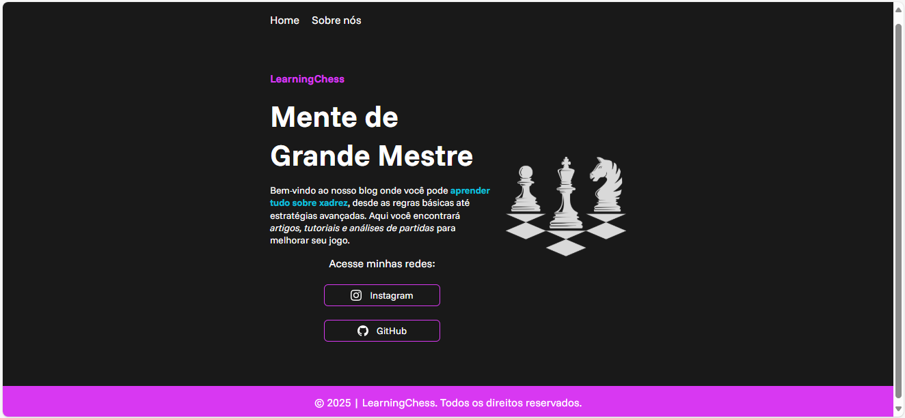
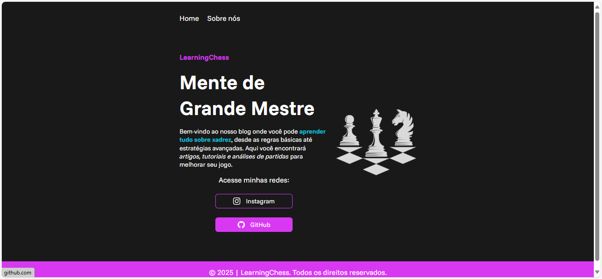
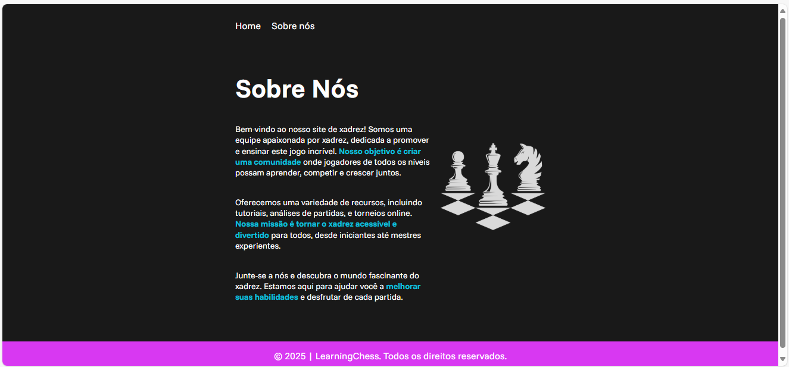

# LearningChess

Bem-vindo ao repositório do meu primeiro site de xadrez! Este projeto é uma introdução ao desenvolvimento web e serve como um ponto de partida para meus futuros projetos.

## Descrição do Projeto

Este site foi criado com o objetivo de estudar os seguintes temas (respectivos cursos):

1.HTML e CSS ambientes de desenvolvimento, estruturas e boas práticas
2.HTML e CSS - Classes, posicionamento e Flexbox
3.HTML e CSS  - cabeçalho, footer e variáveis CSS

Em vista disso, buscou-se apresentar uma interface simples para um projeto de plataforma de site de xadrez online. 

## Tecnologias Utilizadas

- HTML
- CSS

## Comentários no Código

Algumas partes do código contêm comentários /* e foram mantidas apenas para que eu me lembre do que fazer nos próximos passos. Estes comentários são temporários e serão removidos nas versões futuras do projeto.

## Demonstração do Projeto

{:height="300px" width="400px"}
{:height="300px" width="400px"}
{:height="300px" width="400px"}

## Demonstração da Construção do Design com a Tecnologia do Figma

{:height="300px" width="400px"}

## Como Contribuir

Se você deseja contribuir para este projeto, siga os passos abaixo:

1. Faça um fork deste repositório.
2. Crie uma nova branch (`git checkout -b feature/nova-feature`).
3. Faça commit das suas alterações (`git commit -m 'Adiciona nova feature'`).
4. Faça push para a branch (`git push origin feature/nova-feature`).
5. Abra um Pull Request.

## Contato

Se você tiver alguma dúvida ou sugestão, sinta-se à vontade para entrar em contato.

Obrigado por visitar meu repositório!

